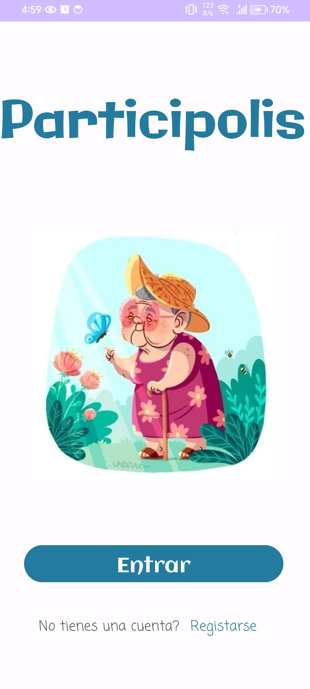
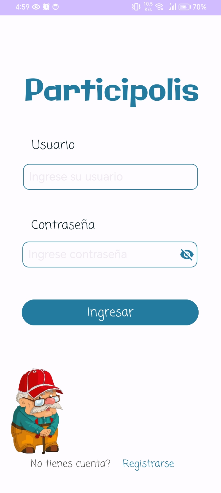
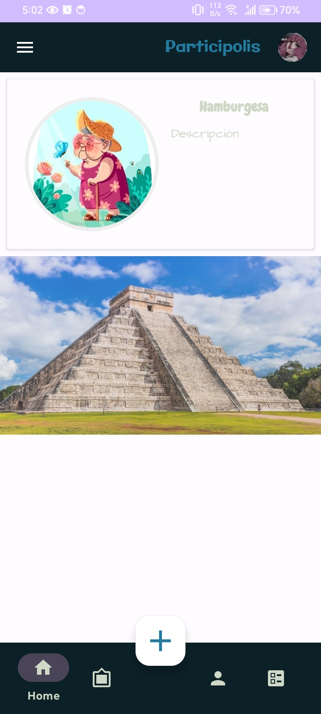
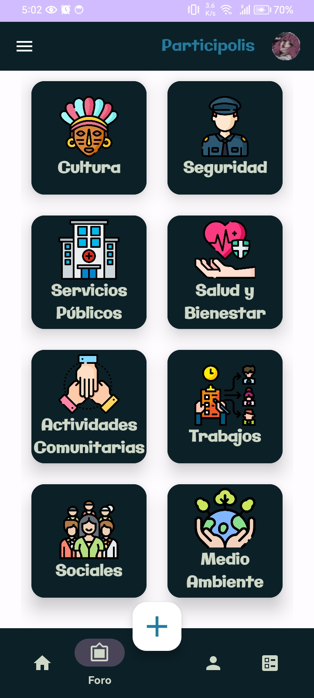
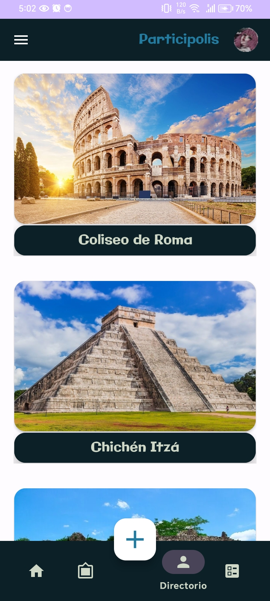
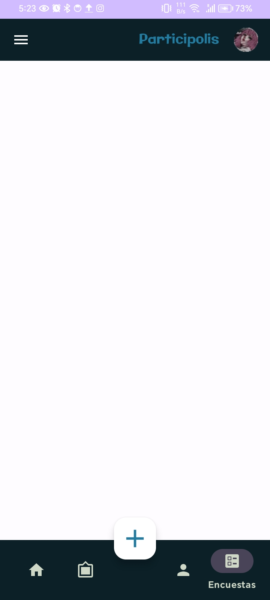
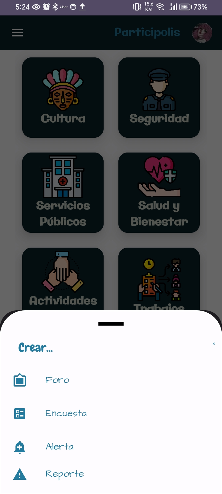
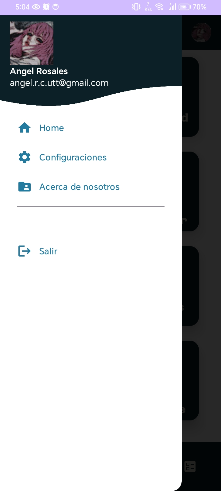

<h1 align="center">📱 Participolis</h1>
<p align="center">
  <em>Connecting communities through collaboration and engagement</em>
</p>

<p align="center">
  
  
  
  
  
</p>

---

## 🌟 About Participolis

**Participolis** is an Android application built with **Kotlin** and **Firebase** to enhance **community participation and connectivity**.  
It allows users to **join discussions, create forums, share alerts, and respond to surveys** to strengthen neighborhood collaboration.  

---

## ✨ Features

✔ **Splash Screen** – Clean and modern start screen  
✔ **User Authentication** – Login and registration powered by Firebase Auth  
✔ **Personal Profile** – Manage user data easily  
✔ **Forums** – Discuss topics like:
- Culture  
- Security  
- Public Services  
- Health & Wellness  
- Community Activities  
- Jobs  
- Social Topics  
- Environment  

✔ **Community Directory** – Browse important local places  
✔ **Surveys** – Create or vote in polls  
✔ **Quick Action Button** – Post forums, surveys, alerts, or reports instantly  
✔ **Real-time Chat** – Engage in discussions dynamically  
✔ **Profile Menu** – Access settings via the hamburger menu  

---

## 🔐 Authentication & Security

- Secure user login with **Firebase Authentication**  
- Session management for a safe and smooth experience  

---

## 📸 Screenshots

_Add your screenshots here (recommended width ~250px for neat layout)._  

| Splash Screen | Login Screen | Home | Forums |
|---------------|-------------|------|--------|
|  |  |  |  |

| Directory | Surveys | Create Menu | Profile |
|-----------|--------|------------|---------|
|  |  |  |  |

---

## 🛠 Tech Stack

- **Platform:** Android  
- **Language:** Kotlin  
- **Database & Auth:** Firebase Firestore + Firebase Authentication  
- **Other:** Material Design, Real-time updates  

---

## 🚀 Getting Started

### ✅ Installation
```bash
git clone https://github.com/your-username/participolis.git
cd participolis
# Open in Android Studio and build
